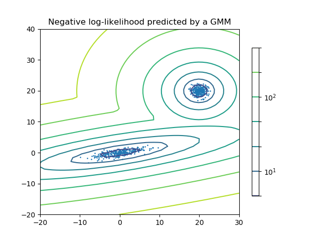

# Gaussian Mixture Model

<!-- To compile this

"python3 -m readme2tex --output README.md .README.md --username matwilso --project implementations --branch master --svgdir numpy/gmm/svgs

-->


## Resources

1. https://www2.ee.washington.edu/techsite/papers/documents/UWEETR-2010-0002.pdf
1. http://cs229.stanford.edu/notes/cs229-notes7b.pdf
1. https://people.eecs.berkeley.edu/~pabbeel/cs287-fa13/slides/Likelihood_EM_HMM_Kalman.pdf

NOTE: this page is pretty rough, still in progress


## About

A Gaussian Mixture Model (GMM) is a method used to cluster a set of data based
on the assumption that it can be described by K different Gaussian distributions,
each parameterized by a mean and covariance. 

Intuitively, it is similar to other clustering algorithms, like [k-means](https://en.wikipedia.org/wiki/K-means_clustering), that seek to bunch up data together and
draw boundaries.
However, it tends to be used more in practice in fields like robotics because it
uses Gaussians, which represent a lot of natural distributions well (Central 
Limit Theorem), and are easier to work with for computing probabilties and 
using Bayesian methods.

Here is an example of such a cluster from [scipy](http://scikit-learn.org/stable/modules/mixture.html), where the contours show equal probabilities. 
Notice how the peaks are highest around the datapoint clusters, but there is 
also decent density between the two clusters.




## Parameterization: what values the GMM is learning

A Gaussian Mixture Model is parameterized by a set of K different Gaussians.  
A standard Gaussian is parameterized by mean $\mu$ and covariance $\Sigma$. A 
mixture model of Gaussians adds to this parameterization a weight $w$ that represents
how likely that Gaussian is.  If there are a lot of datapoints in one cluster (
for example if many points are bunched together), the weight of that cluster 
will he higher because it has more data points.

So we get K clusters each with a $(w, \mu, \Sigma)$, and we start the algorithm 
with a bad guess of what these values are, and gradually learn values for these
that best match the data, using an iterative process described below.

## Fitting the data

Gaussian Mixture Models use the Expectation-Maximization (EM) algorithm for
fitting the data -- for choosing the parameters $(w, \mu, \Sigma)$ so that 
the clusters give the highest likelihood for the data. If you are familiar 
with Maximum Likelihood estimators, this algorithm is a way to approximate
this for the GMM.

Expectation-Maximization is an iterative method which starts with an arbitrary 
guess of the true values of, and gradually updates and changes these to better 
fit the data.

The EM algorithm is usually explained by its two eponymous steps, (E)xpection and (M)aximization.

### E-step

The E-step computes the probalities of the data fitting the current values of the
cluster parameters $(w, \mu, \Sigma)$.  To compute these probabilities, my 
code computes the probability of each u sample $i$ belonging to each cluster 
$j$ of $K$. 

This is done by forming the Multivariate Gaussian probability distribution 
based on our current values of $\mu$ and $\Sigma$. In code, that just looks like:
```
# create a multivariate Gaussian with the parameters of the j Gaussian
# mu is shape (K, D), where D is the dimension of the data
# (i.e., for a 2D Gaussian, mu[j] will be a 2 element array)
# Sigma[j] is a DxD matrix

mvar = scipy.stats.multivariate_normal(mu[j], Sigma[j])

```

We then evaluate this probability distribution ([scipy.multivariate_normal.pdf()](https://docs.scipy.org/doc/scipy-0.14.0/reference/generated/scipy.stats.multivariate_normal.html)) 
for each data sample, for each cluster, weighted by how likely it was to draw
from each cluster. This value is called gamma ($\gamma$) in the code.

Here is the full (non-optimized) code for computing gamma:
```
        # gamma[i][j] is estimated probability of ith sample belonging to jth Gaussian
        gamma = np.zeros([self.N, self.K])
        for i in range(self.N):
            for j in range(self.K):
                mvar = multivariate_normal(self.mu[j], self.Sigma[j])
                gamma[i][j] = self.weights[j] * mvar.pdf(data[i])
            gamma[i, :] /= np.sum(gamma[i, :])

```

### M-step

The M-step does the actual optimization, or fitting of the clusters.

From the E-step, we got gamma: a matrix of how probable it is that the ith 
data sample fits the jth Gaussian, where the probabilty calculations were
based on our current beliefs of our parameters $(w, \mu, \Sigma)$. We now
want to find updates for these that fit the data better. This is an optimization
problem, and we are trying to optimize the probability of seeing the data.
So update our parameters so that they give better predictions of the data.

See [here](https://www2.ee.washington.edu/techsite/papers/documents/UWEETR-2010-0002.pdf) for a more detailed derivation, but below are the basics

#### Derivation

NOTE: this part is still very rough

We are trying to maximize the log probability.  It is a Maximum Likelhiood Estimation
method: finding the parameter values that maximize the likelihood of making 
the observations given the parameters

We are trying to optimize the equation below, where $Z_i$ is cluster, $y_i$ is our observation, and $\theta$ is our parameters $(w, \mu, \Sigma)$.

$$Q_i(\theta | \theta^{(m)} = E_{Z_i | y_i, \theta^{(m)}} [log p_X(y_i, Z_i | \theta)]$$

We want to maximize $Q_i(\theta | \theta^{(m)}$, with the constraint that
all weights must add up to 1 (because they are probabilities).

We write gradients for $Q_i(\theta | \theta^{(m)}$, with respect to all the
parameters, $(w, \mu, \Sigma)$. We then set these to 0 to maximize, and solve
them to get (final code): 

```
            n_list = np.sum(gamma, 1) 
			# this will add gamma probabilities for each data point and normalize
            weight_update = n_list / np.sum(n_list)  # shape = (K,)

            n_inv = (1.0/n_list)[:, np.newaxis] # inv of unnormalized cluster probs
            mu_update =  n_inv * np.dot(gamma.T, data) 

            Sigma_update = np.zeros([self.K, self.D, self.D])

```

<!--
Specifically, for each data sample that we get, we want to maximize the 
probability a

seeing the observation, cluso

We want to maximize the Expectation.
This amounts to wanting the clusters that fit the data points better to also be
the ones that.

We want cluster

we are trying to maximize the Expectation of the probability of 
-->


<!--
The for EM generally is:
$$Q_i(\theta | \theta^{(m)}) = E_{X_i|y_i,\theta^{(m)}}[log p(X_i, \theta)]$$
-->
